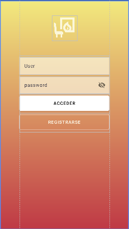
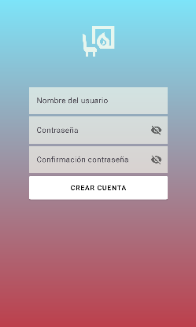
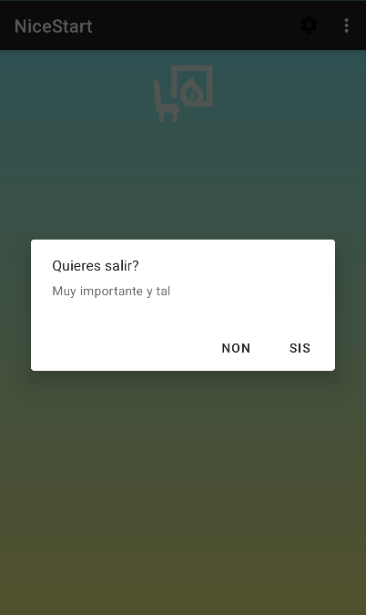
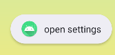

##Hello im mr Iván this is my project##

**I ate my project that is all i love you bye**

LOGIN

SINGUP

Exit Login

Appbar

Context Menu

Notification

**Creador del proyecto**  
ivan

**Autor del README**  
ivan

**Programador principal**  
ivan

**Subprogramador de respaldo (por si acaso)**  
dela

**Director creativo**  
ivan

**Productor ejecutivo**  
ivan

**Director técnico**  
ivan

**Ingeniero de sonido (efectos imaginarios)**  
ivan

**Diseñador de interfaz**  
ivan

**Maquetador CSS**  
ivan

**Ingeniero de infraestructura**  
ivan

**Administrador de servidores**  
ivan

**Guardia de seguridad del repo**  
ivan

**Tester de estrés (pegando al teclado)**  
ivan

**QA (Quality Assurance y Queen of Apologies)**  
ivan

**Arquitecto de la base de datos**  
ivan

**Modelador de datos**  
ivan

**Depurador profesional**  
ivan

**Manejador de excepciones**  
ivan

**Revisor de commits**  
ivan

**Policía de commits (mensaje obligatorio)**  
ivan

**Autor de commits salvajes a las 3AM**  
ivan

**Mantenedor del CI/CD**  
ivan

**Config master (Docker, scripts, magia)**  
ivan

**Generador de scripts de despliegue**  
ivan

**Historietista de commits**  
ivan

**Redactor de CHANGELOG**  
ivan

**Traductor automático (en su cabeza)**  
ivan

**Localizador internacional (solo español y sarcasmo)**  
ivan

**Creador del logo (dibujado con el ratón)**  
ivan

**Director de arte**  
ivan

**Animador (gif en loop)**  
ivan

**Editor de vídeo (cortes épicos)**  
ivan

**Product Owner (señala con dedo)**  
ivan

**Scrum Master (grita sprint)**  
ivan

**Planificador de sprints**  
ivan

**Prioritizador de issues**  
ivan

**Cazador de bugs**  
ivan

**Domador de dependencias**  
ivan

**Actualizador de paquetes**  
ivan

**Mago del package.json**  
ivan

**Conserje del repo (limpia ramas)**  
ivan

**Administrador de ramas**  
ivan

**Git whisperer**  
ivan

**Escritor de tests unitarios**  
ivan

**Escritor de tests de integración**  
ivan

**Escritor de tests que pasan a la primera (mentira)**  
ivan

**Documentador (comentarios profundos)**  
ivan

**Ilustrador de diagramas UML (hechos con Paint)**  
ivan

**Fotógrafo de pantalla (screenshots v1)**  
ivan

**Responsable de issues (asigna a... ivan)**  
ivan

**Moderador de PRs**  
ivan

**Revisor de seguridad (mira todo con lupa)**  
ivan

**Auditor de licencias (elige MIT porque suena bien)**  
ivan

**Contable (lleva la contabilidad imaginaria)**  
ivan

**Relaciones públicas (publica un tweet)**  
ivan

**Community Manager (responde con memes)**  
ivan

**Embajador de la marca**  
ivan

**Entrenador de onboarding**  
ivan

**Mentor de interns (a su gato)**  
ivan

**Capitán del README.md**  
ivan

**Ilusionista de la documentación (aparece y desaparece)**  
ivan

**Cocinero de snacks para maratones de código**  
ivan

**Proveedor oficial de café (virtual)**  
ivan

**Ceremonial bug-fixer**  
ivan

**Arquitecto de experiencia de usuario**  
ivan

**Psicólogo del usuario (escucha clicks)**  
ivan

**Analista de métricas (mira Spreadsheet)**  
ivan

**SEO specialist (optimiza la palabra NiceStart)**  
ivan

**Tester de accesibilidad (tab, tab, tab)**  
ivan

**Leyenda viva del teclado**  
ivan

**Embellecedor de commits**  
ivan

**Firmante legal (firma con emoticono)**  
ivan

**Diseñador de la mascota (dibujada a mano alzada)**  
ivan

**Guionista (escribe esta lista)**  
ivan

**Actor de voz (susurra “NiceStart”)**  
ivan

**Especialista en nombrado de variables**  
ivan

**Custodio del buen gusto**  
ivan

**Guardador de secretos (contraseñas en Notepad)**  
ivan

**Soporte técnico (responde a su propio issue)**  
ivan

**Backup humano (copia en su USB)**  
ivan

**TODO LO DEMÁS**  
ivan

**Agradecimientos especiales con mucho amor y cariño**
dela

**Renuncia**
Estos creditos deben tomarse de la forma mas ironica posible